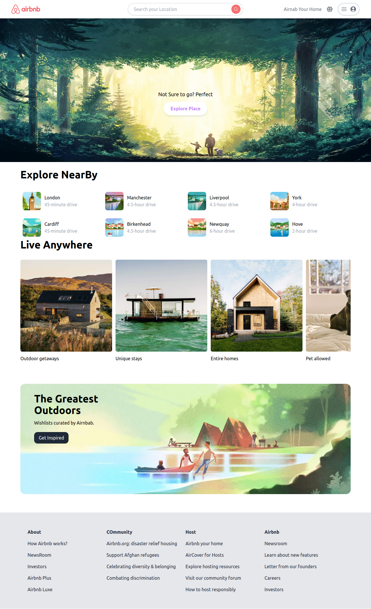
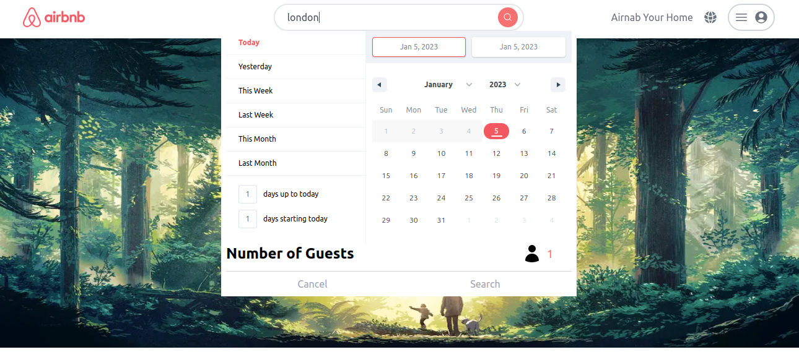
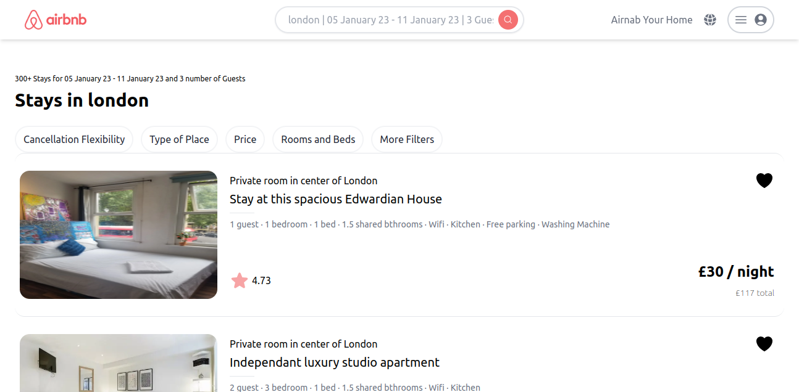
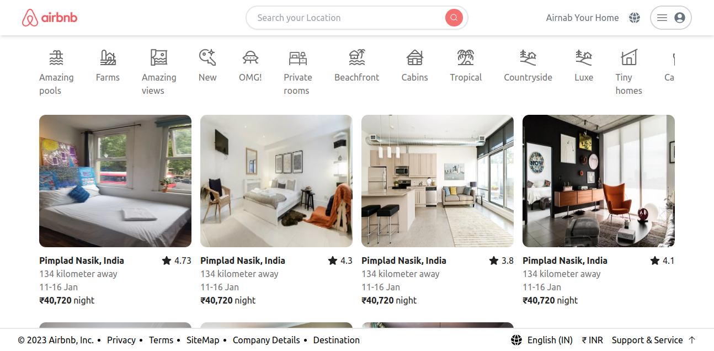
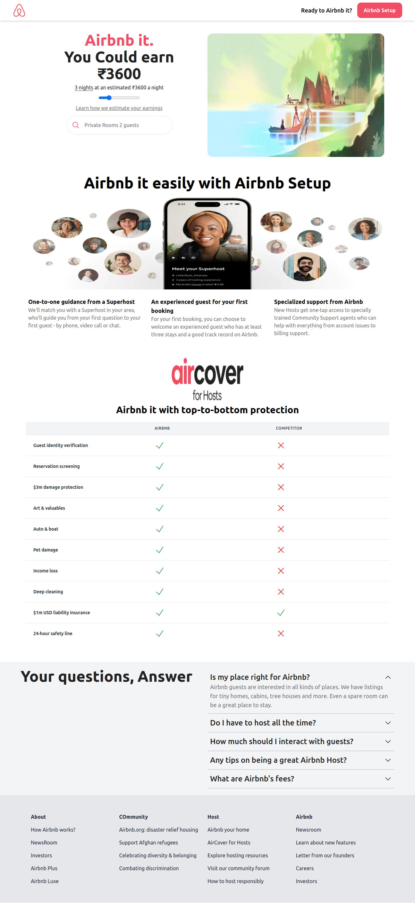
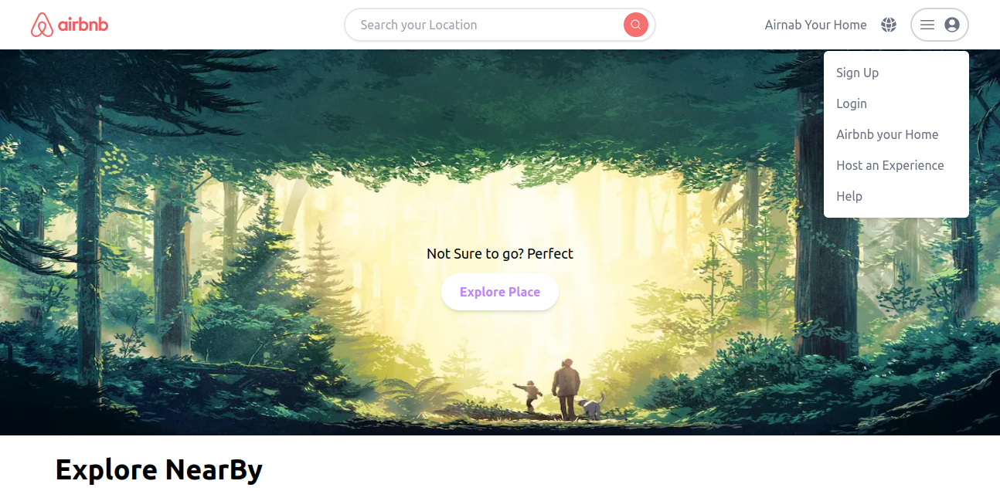

# Airbnb Clone

## Demo

[https://airbnbduplicate.netlify.app/](https://airbnbduplicate.netlify.app/)

### Technology 

- [NextJs](https://nextjs.org/)
- [TailwindCss](https://nextjs.org/)
- [@badrap/bar-of-progress](https://www.npmjs.com/package/@badrap/bar-of-progress/)
- [react-date-range](https://www.npmjs.com/package/react-date-range)

## How to use

Clone GitHub Project on your PC

```bash
git clone https://github.com/nayanrdeveloper/airnab_clone
```

```bash
npm install
```

```bash
npm run dev
```

Open your Project in browser (http://localhost:3000/)

### Prerequisites

* [nodejs](https://nodejs.org/en/download/) for install require package with npm

```bash
npx create-next-app@latest
```

### Screenshots

Home



Search Calendar



Search Place



Explore Place



Host



User Drop Down




